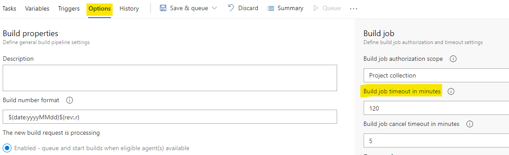

# Troubleshooting <!-- omit in toc -->

- [Namespaces needs to be set to non-zero](#Namespaces-needs-to-be-set-to-non-zero)
- [Change Folder Buildkit](#Change-Folder-Buildkit)
- [Agent ran longer than the maximum time of 60 minutes](#troubleshooting-stalled-deployments-and-ci)

## Troubleshooting

### Namespaces needs to be set to non-zero
This error is due to the fact that BuildKit needs to create a new user namespace, and the default maximum number of namespaces is 0. Value is defined by `user.max_user_namespaces` ([documentation](https://man7.org/linux/man-pages/man7/namespaces.7.html)). You can fix it by setting the value to more than 1000. Issue notably happens on AWS Bottlerocket OS. [See related issue.](https://github.com/clemlesne/azure-pipelines-agent/issues/19)

We can update dynamically the host system settings with a DaemonSet:

```yaml
# daemonset.yaml
apiVersion: apps/v1
kind: DaemonSet
metadata:
  labels:
    app.kubernetes.io/component: sysctl
    app.kubernetes.io/name: sysctl-max-user-ns-fix
    app.kubernetes.io/part-of: azure-pipelines-agent
  name: sysctl-max-user-ns-fix
spec:
  selector:
    matchLabels:
      app.kubernetes.io/name: sysctl-max-user-ns-fix
  template:
    metadata:
      labels:
        app.kubernetes.io/name: sysctl-max-user-ns-fix
    spec:
      containers:
        - name: sysctl-max-user-ns-fix
          image: docker.io/library/busybox:1.36
          command:
            [
              "sh",
              "-euxc",
              "sysctl -w user.max_user_namespaces=63359 && sleep infinity",
            ]
          securityContext:
            privileged: true
```

### Change Folder Buildkit
If need Buildkit to write in another folder, then create the buildkitd.toml file and set the root variable. Example below (bash in the pipeline):

```bash
mkdir ~/.config/buildkit
echo 'root = "/app-root/.local/tmp/buildkit"' > ~/.config/buildkit/buildkitd.toml
```

### Agent ran longer than the maximum time of 60 minutes
In this case it is necessary to increase the timeout in Azure DevOps, in Options and Build job timeout in minutes. Image below:

