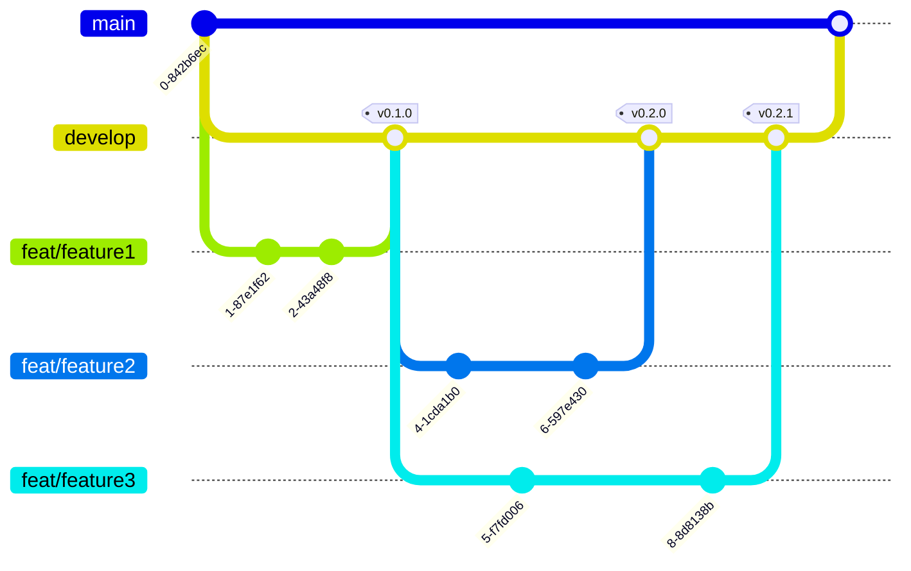
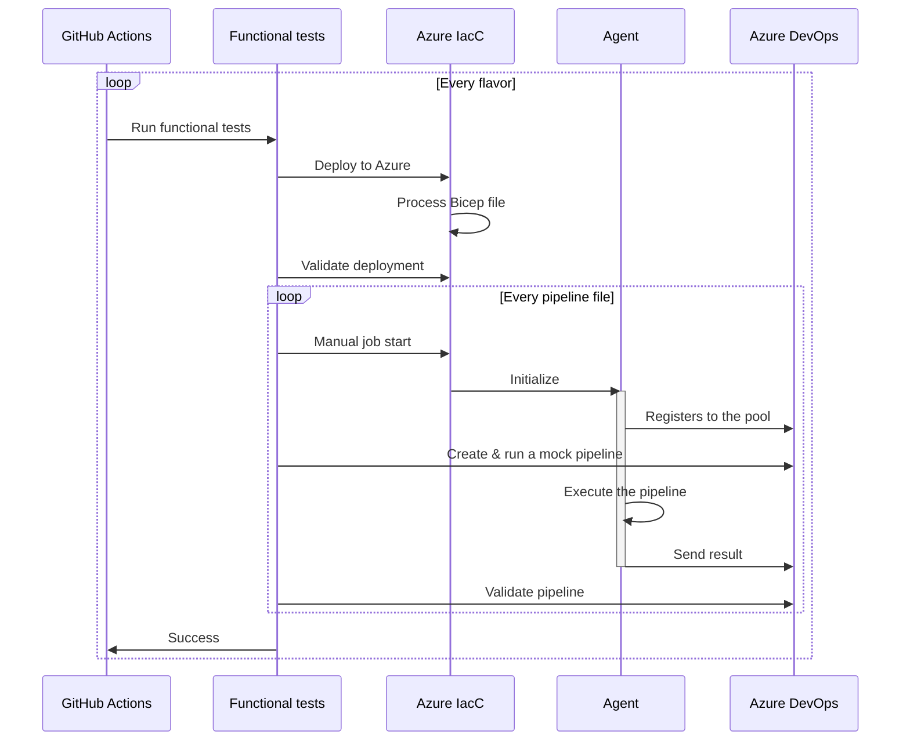

## Version control

Git flow is used for version control. The main branch is `main` and the development branch is `develop`. Feature branches are created from `develop` and merged back into `develop` when the feature is complete. When a release is ready, `develop` is merged into `main` and a tag is created.

Version number is compliant to [Semantic Versioning](https://semver.org/) and dynamically generated by [gitops-version](https://github.com/clemlesne/gitops-version).

## Functional tests

Functional tests are run on every pull request and on every commit to `develop` and `main` branches. Azure DevOps is contacted to validate each pipeline run.

